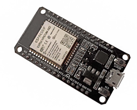

# Sistema IoT para Monitorar a Qualidade do Ar com ESP32

# Descrição:

O projeto consiste em um sistema de monitoramento de qualidade do ar utilizando um sensor de gás MQ-2, LEDs indicativos, um Buzzer para alarmes sonoros, um display LCD para exibir informações e comunicação via protocolo MQTT para integração com a internet. Utilizamos uma ESP32 para controle doss componentes e gerenciamento da comunicação.

# Materiais:

- ESP32;
- Sensor MQ-2;
- Display LCD 16X2 com Blacklight Azul e I2C;
- Protoboard 830;
- Cabos Jumper Macho/Fêmea;
- Resistor 10k 1/4 W 5% de Tolerância;
- Módulo Buzzer 5V Passivo;
- LEDS Vermelho e Verde.

# Descrição Materiais:

A plataforma de prototipagem eletrônica escolhida foi a ESP32 devido à sua robustez, facilidade de uso, grande comunidade de suporte e baixo custo. Além disso, a ESP32 oferece conectividade Wi-Fi e Bluetooth integradas, tornando-a ideal para projetos de IoT. Sua função será coletar dados e enviar essas informações através da internet utilizando o protocolo MQTT, e ainda aproveitando sua capacidade de conexão sem fio nativa.

 
		
O sensor escolhido foi o MQ-2 que é capaz de detectar gases inflamáveis, como gás metano, hidrogênio, propano, butano e gases de fumaça. É comumente usado em sistemas de detecção de vazamentos de gás em residências, bem como em alarmes de incêndio para detectar a presença de fumaça e outros gases inflamáveis no ar. Esse sensor MQ desempenha papéis importantes em uma variedade de aplicações, fornecendo informações essenciais sobre a presença de gases nocivos ou inflamáveis no ambiente.

 
Iremos utilizar um Display LCD 16x2 com Backlight Azul e I2C para que possamos visualizar quando a qualidade do ar estiver boa e quando estiver ruim, será apresentado na tela essa informação. 

Além disso, usaremos uma Protoboard Breadboard 830 Pontos onde será montado o circuito do projeto, que nos permite fazer conexões entre os componentes eletrônicos.

 
Também iremos utilizar Kits Jumper Macho e Fêmea para fazer as conexões entre os componentes na protoboard. Eles são essenciais para conectar os dispositivos de forma rápida e fácil.

Os resistores 10kΩ serão utilizados em diversos pontos do circuito para limitar a corrente e proteger os componentes. Os resistores de 10kΩ são usados em aplicações de divisão de tensão e pull-up/pull-down. 

 
Como atuador iremos utilizar um Buzzer Passivo, que será acionado quando a qualidade do ar for considerada ruim. 

Usaremos dois LEDs um na cor vemelha e outro na cor verde, sendo o vermelho acionado quando detectado gases no ambiente e o verde inidicando que a qualidade do ar está boa. 

# ESP 32

A ESP32 é um microcontrolador desenvolvido pela Espressif Systems, reconhecido por sua alta performance e versatilidade. Baseada em um chip dual-core Xtensa LX6, a ESP32 é amplamente utilizada em projetos de Internet das Coisas (IoT) devido às suas capacidades integradas de Wi-Fi e Bluetooth, combinando conectividade robusta com um consumo de energia eficiente.

Principais Características
- Possui um processamento CPU Dual-core Xtensa LX6, com clock de até 240 MHz, com memória que inclui 520 KB de SRAM e suporte para flash externo de até 16 MB.
- A sua conectividade Wi-Fi: suporta os padrões 802.11 b/g/n, permitindo a comunicação em redes locais e a conexão com a internet.
- Também possui Bluetooth que é compatível com BLE (Bluetooth Low Energy) e Bluetooth Clássico, ideal para comunicação com dispositivos móveis e sensors. A interfaces de  entradas e saídas (I/O), oferece diversos pinos GPIO, além de interfaces UART, SPI, I2C e I2S.
- Possui ADCs (Conversores Analógico-Digital) e DACs (Conversores Digital-Analógico), essenciais para leitura de sensors e controle de atuadores.

A ESP32 se destaca pelo seu gerenciamento de energia, possuindo modos de operação que permitem reduzir o consumo durante períodos de inatividade, o que é crucial para aplicações que dependem de baterias. A versatilidade da ESP32 a torna adequada para uma ampla gama de aplicações. Entre as mais comuns estão a automação residencial para controle de dispositivos domésticos, como iluminação, climatização e segurança. Wearables que são dispositivos vestíveis que monitoram saúde e atividades físicas, aproveitando a conectividade Bluetooth. Além disso, sistemas de monitoramento remoto, utilizada em sensores ambientais e de infraestrutura, fornecendo dados em tempo real. Em projetos educacionais e de prototipagem; devido à sua facilidade de uso e suporte extensivo da comunidade, sendo uma escolha popular em projetos DIY e educacionais.

Programar a ESP32 é acessível, com suporte a diversas plataformas de desenvolvimento, como o Arduino IDE, sendo um dos ambientes mais populares, permitindo utilizar bibliotecas e exemplos prontos. A própria Espressif ESP-IDF que é a ferramenta oficial da Espressif, mais poderosa e flexível, ideal para projetos profissionais. E o MicroPython, uma implementação do Python otimizada para microcontroladores, facilitando a programação para quem já tem familiaridade com Python.

Sendo assim, a ESP32 é uma solução robusta e versátil para o desenvolvimento de aplicações IoT, combinando alto desempenho, conectividade abrangente e eficiência energética. Seja para projetos simples de automação residencial ou para sistemas complexos de monitoramento industrial, a ESP32 oferece as ferramentas e capacidades necessárias para transformar ideias em realidade.

# Prototipação do Dispositvo 

# Ligações
- A primeira peça a ser conectada ao ESP32 foi o Display LCD 16x2 com Backlight Azul e I2C, ligue o GND ao polo negativo da protoboard, o VCC ao polo positivo da protoboard, o SDA ao pino D21 e o SCL ao pino D22 da ESP32.
- Depois conectamos o Sensor MQ-2, sendo o GND ao polo negativo da protoboard, o VCC ao polo positivo da protoboard, o AO ao pino D32 e o DO ao pino D34 da ESP32.
- Em seguida conectamos o Buzzer, conecte GND ao polo negativo da protoboard, o VCC ao polo positivo da protoboard e o I/O ao D23 da ESP32.
- Logo, conectamos o LED Vermelho, primeiro conecte um resistor de 10ohms ao pino negativo da protoboard, depois ligue um Jumper onde o resistor está conectado até o polo negativo do LED.
- Em seguida ligue o polo positivo com um Jumper na ESP32 no pino D2. Agora vamos ligar o LED Verde, vamos repetir os primeiro passos, então primeiro conecte um resistor de 10ohms ao pino negativo da protoboard, depois ligue um Jumper onde o resistor está conectado até o polo negativo do LED. Em seguida ligue o polo positivo com um Jumper na ESP32 no pino D14.
- Agora vamos alimentar a Protoboard, basta ligar o polo positivo ao pino VIN da placa ESP32 e o polo negativo ao GND também da placa, feito isso então conectamos a placa ESP32 via USB Serial, no qual ela será alimentada. (PORTAL VIDA DE SILICIO, 2024).

# Protocolo MQTT

O MQTT(Message Queuing Telemetry Transport) é um protocolo de comunicação máquina para máquina (M2M - Machine to Machine) com foco em Internet of Things (IoT) que funciona em cima do protocolo TCP/IP. Um sistema MQTT se baseia na comunicação entre cliente e servidor, em que o primeiro pode realizar tanto “postagens” quanto “captação” de informação e o segundo administra os dados a serem recebidos e enviados. Para isso, é utilizado um Paradigma chamado Publish-Subscribe.

Utilizamos a biblioteca PubSubClient para comunicação MQTT. Sendo assim, os dados então são coletados pelos dispotivos IOT, em seguida o Publish reune os dados em mensagens com o endereço de destino, que no caso é o tópico, e os entrega ao mensageiro que é o MQTT. O MQTT recebe as mensagens e entrega ao Broker do Ubidots. O Broker recebe as mensagens do mensageiro MQTT e as direciona para o destino, que são os Subscriber que estão inscritos no tópico e assim atualiza os dados no dashboard criado.

# Protótipo

# Realizado por :  

Maiara Sousa

Julia Anjos
 

